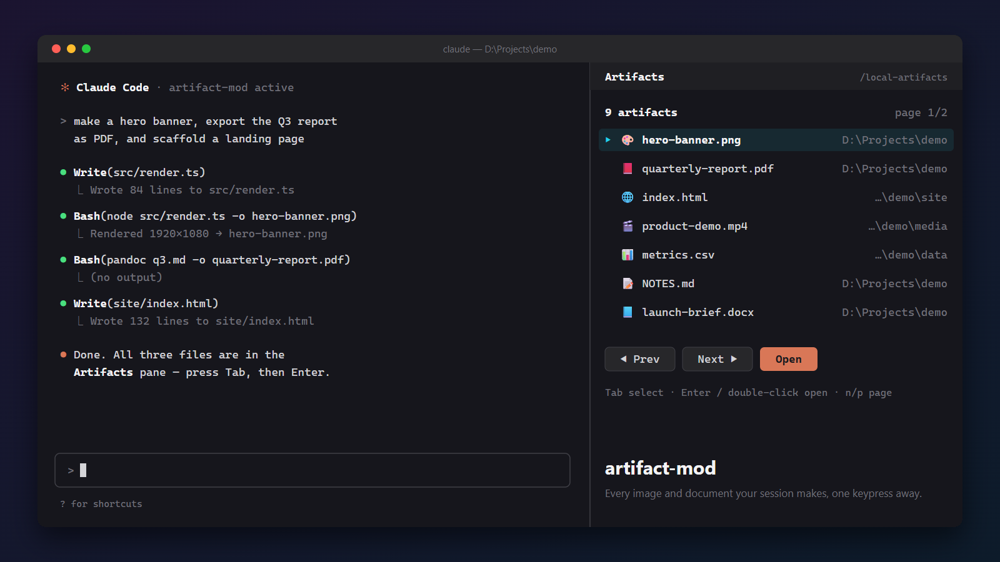

# claude-artifact-mod

A Claude Code plugin for handling locally produced artifacts and files.



**artifact-mod** adds a side pane that lists the media files and documents created during a session (images, PDFs, office documents, spreadsheets, Markdown, HTML, audio, video), each with an icon for its file type. Opening an item launches it in your system's default app.

## Install

At the prompt of a Claude Code terminal session:

```
/plugin install artifact-mod --marketplace netgfx/claude-artifact-mod
```

Answer `y` to add the marketplace, then pick a scope (user scope is the default).

## Features

- **Automatic tracking.** After any tool call, files it created are added: paths named in the tool's input, path-like tokens in shell commands (`> out.txt`, `-o report.pdf`, `"$PWD/out.png"`), and new files at the top level of the working directory or in the folders of any paths the tool named. A read-only tool counts only for the file it was told to save (a browser screenshot's `filename`). Files that already existed and were only edited are left out, as are `.git`, `node_modules` and Claude Code's `.output` task logs.
- **Paths only.** The mod stores each artifact's local path and nothing else. The list lasts for the session and survives resume.
- **Stays in sync with disk.** Files deleted from disk disappear from the pane within a few seconds.
- **Media and documents only.** 🎨 images, 📕 PDF, 📘 Word/ODT/RTF, 📙 slides, 📊 spreadsheets, 📝 text/Markdown, 🌐 HTML, 🎵 audio, 🎬 video. Code, config, archives and binaries are not listed.
- **Pagination.** Page size fits the pane's height. ◀ Prev / Next ▶ (`p` / `n`).
- **Open with the default app.** `explorer.exe` on Windows, `open` on macOS, `xdg-open` on Linux.

## Usage

| Action | Result |
| --- | --- |
| `/local-artifacts` | Open the pane and give it the keyboard |
| Tab | Select an item |
| Enter, or `o` | Open the selected item |
| Double-click | Open an item |
| `n` / `p` | Next / previous page |

## Development

```
claude plugin validate .
claude plugin test .
claude --plugin-dir .
```

## License

MIT
